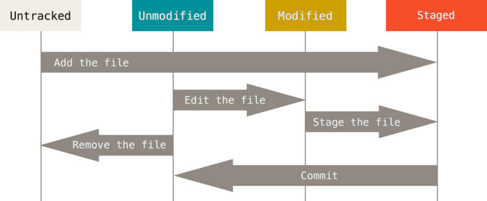

# 파일의 상태 확인하기
## 수정하고 저장소에 저장하기


### 파일의 상태 확인하기
```
$ git status
On branch master
Your branch is up-to-date with 'origin/master'.
nothing to commit, working directory clean
```
파일을 새로 생성하면 **Untracked** 상태이다.
```
$ git status
On branch master
Your branch is up-to-date with 'origin/master'.
Untracked files:
  (use "git add <file>..." to include in what will be committed)

    README

nothing added to commit but untracked files present (use "git add" to track)
```

### 파일을 새로 추적하기
`git add` 명령을 통해 **Tracked** 상태이면서 커밋에 추가될 **Staged** 상태가 된다. 
```
$ git add README

$ git status
On branch master
Your branch is up-to-date with 'origin/master'.
Changes to be committed:
  (use "git reset HEAD <file>..." to unstage)

    new file:   README
```

### Modified 상태의 파일을 Stage 하기
이미 **Tracked** 상태인 파일을 수정하면 **Staged** 상태가 아니다.
```
$ git status
On branch master
Your branch is up-to-date with 'origin/master'.
Changes to be committed:
  (use "git reset HEAD <file>..." to unstage)

    new file:   README

Changes not staged for commit:
  (use "git add <file>..." to update what will be committed)
  (use "git checkout -- <file>..." to discard changes in working directory)

    modified:   CONTRIBUTING.md
```
마찬가지로 `git add` 명령을 통해 Staged 상태로 만든다.
`git add` 명령은 파일을 새로 추적할 때도 사용하고 수정한 파일을 Staged 상태로 만들 때도 사용한다.
Merge 할 때 충돌난 상태의 파일을 Resolve 상태로 만들때도 사용한다.
`git add`의 의미는 프로젝트에 파일을 추가한다기 보다는 다음 커밋에 추가한다고 받아들이는게 좋다.

```
$ git add CONTRIBUTING.md
$ git status
On branch master
Your branch is up-to-date with 'origin/master'.
Changes to be committed:
  (use "git reset HEAD <file>..." to unstage)

    new file:   README
    modified:   CONTRIBUTING.md
```

### 파일 상태를 짤막하게 확인하기
`git status -s` 또는 `git status --short` 처럼 옵션을 주면 현재 변경한 상태를 짤막하게 보여준다.
```\
$ git status -s
 M README
MM Rakefile
A  lib/git.rb
M  lib/simplegit.rb
?? LICENSE.txt
```
아직 추적하지 않는 새 파일 앞에는 `??` 표시가 붙는다. **Staged** 상태로 추가한 파일 중 새로 생성한 파일 앞에는 `A` 표시가, 수정한 파일 앞에는 `M` 표시가 붙는다. 위 명령의 결과에서 상태정보 컬럼에는 두 가지 정보를 보여준다. 왼쪽에는 Staging Area에서의 상태를, 오른쪽에는 Working Tree에서의 상태를 표시한다. 

### 파일 무시하기
파일을 무시하려면 `.gitignore` 파일을 만들고 그 안에 무시할 파일 패턴을 적는다.
```
$ cat .gitignore
*.[oa]
*~
```
`.gitignore` 파일에 입력하는 패턴은 아래 규칙을 따른다.
- 아무것도 없는 라인이나, # 로 시작하는 라인은 무시한다.
- 표준 Glob 패턴을 사용한다. 이는 프로젝트 전체에 적용된다.
- 슬래시(/)로 시작하면 하위 디렉토리에 적용되지(Recursivity) 않는다.
- 디렉토리는 슬래시(/)를 끝에 사용하는 것으로 표현한다.
- 느낌표(!)로 시작하는 패턴의 파일은 무시하지 않는다.

Glob 패턴은 정규표현식을 단순하게 만든 것으로 생각하면 되고 보통 쉘에서 많이 사용한다. 애스터리스크(*)는 문자가 하나도 없거나 하나 이상을 의미하고, [abc] 는 중괄호 안에 있는 문자 중 하나를 의미한다(그러니까 이 경우에는 a, b, c). 물음표(?)는 문자 하나를 말하고, [0-9] 처럼 중괄호 안의 캐릭터 사이에 하이픈(-)을 사용하면 그 캐릭터 사이에 있는 문자 하나를 말한다. 애스터리스크 2개를 사용하여 디렉토리 안의 디렉토리 까지 지정할 수 있다. a/**/z 패턴은 a/z, a/b/z, a/b/c/z 디렉토리에 사용할 수 있다.

아래는 `.gitignore` 파일의 예이다.
```
# 확장자가 .a인 파일 무시
*.a

# 윗 라인에서 확장자가 .a인 파일은 무시하게 했지만 lib.a는 무시하지 않음
!lib.a

# 현재 디렉토리에 있는 TODO파일은 무시하고 subdir/TODO처럼 하위디렉토리에 있는 파일은 무시하지 않음
/TODO

# build/ 디렉토리에 있는 모든 파일은 무시
build/

# doc/notes.txt 파일은 무시하고 doc/server/arch.txt 파일은 무시하지 않음
doc/*.txt

# doc 디렉토리 아래의 모든 .pdf 파일을 무시
doc/**/*.pdf
```

### Staged와 Unstaged 상태의 변경 내용을 보기
어떤 내용이 변경됐는지 살펴보려면 `git diff` 명령을 사용해야 한다.
```
$ git diff
diff --git a/CONTRIBUTING.md b/CONTRIBUTING.md
index 8ebb991..643e24f 100644
--- a/CONTRIBUTING.md
+++ b/CONTRIBUTING.md
@@ -65,7 +65,8 @@ branch directly, things can get messy.
 Please include a nice description of your changes when you submit your PR;
 if we have to read the whole diff to figure out why you're contributing
 in the first place, you're less likely to get feedback and have your change
-merged in.
+merged in. Also, split your changes into comprehensive chunks if your patch is
+longer than a dozen lines.

 If you are starting to work on a particular area, feel free to submit a PR
 that highlights your work in progress (and note in the PR title that it's
```

만약 커밋하려고 Staging Area에 넣은 파일의 변경 부분을 보고 싶으면 `git diff --staged` 옵션을 사용한다. 이 명령은 저장소에 커밋한 것과 Staging Area에 있는 것을 비교한다.
```
$ git diff --staged
diff --git a/README b/README
new file mode 100644
index 0000000..03902a1
--- /dev/null
+++ b/README
@@ -0,0 +1 @@
+My Project
```
`git diff` 는 `Unstaged` 상태인 것들만 보여준다. 수정한 파일을 모두 Staging Area에 넣었다면 `git diff 명령은 아무것도 출력하지 않는다.

### 변경사항 커밋하기
```
$ git commit

$ git commit -m "Story 182: Fix benchmarks for speed"
[master 463dc4f] Story 182: Fix benchmarks for speed
 2 files changed, 2 insertions(+)
 create mode 100644 README
```

### Staging Area 생략하기
`git commit` 명령을 실행할 때 `-a` 옵션을 추가하면 Git은 `Tracked` 상태의 파일을 자동으로 Staging Area에 넣는다. 그래서 `git add` 명령을 실행하는 수고를 덜 수 있다.
```
$ git status
On branch master
Your branch is up-to-date with 'origin/master'.
Changes not staged for commit:
  (use "git add <file>..." to update what will be committed)
  (use "git checkout -- <file>..." to discard changes in working directory)

    modified:   CONTRIBUTING.md

no changes added to commit (use "git add" and/or "git commit -a")
$ git commit -a -m 'added new benchmarks'
[master 83e38c7] added new benchmarks
 1 file changed, 5 insertions(+), 0 deletions(-)
```

### 파일 삭제하기
Git에서 파일을 제거하려면 `git rm` 명령으로 `Tracked` 상태의 파일을 삭제한 후에(정확하게는 Staging Area에서 삭제하는 것) 커밋해야 한다. 이 명령은 워킹 디렉토리에 있는 파일도 삭제하기 때문에 실제로 파일도 지워진다.
`git rm` 명령을 사용하지 않고 워킹 디렉터리에서 파일을 삭제하고 `git status` 명령으로 상태를 확인하면 Git은 현재 “Changes not staged for commit” (즉, **Unstaged** 상태)라고 표시해준다.
```
$ git rm PROJECTS.md
rm 'PROJECTS.md'
$ git status
On branch master
Your branch is up-to-date with 'origin/master'.
Changes to be committed:
  (use "git reset HEAD <file>..." to unstage)

    deleted:    PROJECTS.md
```

또 Staging Area에서만 제거하고 워킹 디렉토리에 있는 파일은 지우지 않고 남겨둘 수 있다. 다시 말해서 하드디스크에 있는 파일은 그대로 두고 Git만 추적하지 않게 한다.
```
$ git rm --cached README
```

여러 개의 파일이나 디렉토리를 한꺼번에 삭제할 수도 있다. 아래와 같이 git rm 명령에 file-glob 패턴을 사용한다.
```
$ git rm log/\*.log
```

### 파일 이름 변경하기
사실 `git mv` 명령은 아래 명령어를 수행한 것과 완전 똑같다.
```
$ git mv file_from file_to
```